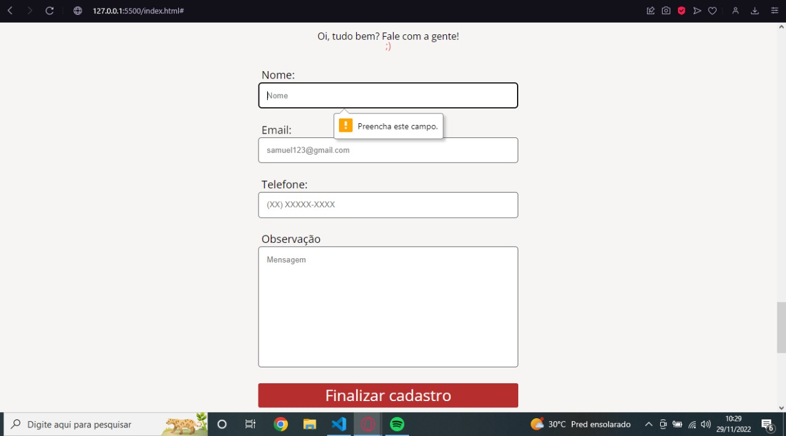

<h1 align="center"> Apeperia Acessibility </h1>

Site desenvolvido em cima de um projeto FIGMA criado pela alura, desenvolvido 100% por mim usando HTML5 e CSS3

  <a href="#-tecnologias">Tecnologias</a>&nbsp;&nbsp;&nbsp;|&nbsp;&nbsp;&nbsp;
  <a href="#-projeto">Projeto</a>&nbsp;&nbsp;&nbsp;|&nbsp;&nbsp;&nbsp;
  <a href="#-layout">Layout</a>&nbsp;&nbsp;&nbsp;|&nbsp;&nbsp;&nbsp;

 

  

  

  

## 🚀 Tecnologias

Esse projeto foi desenvolvido com as seguintes tecnologias:

- HTML e CSS
- Git e Github

## 💻 Projeto

Um site desenvolvido para PCDs.

## 🔖 Layout

Você pode visualizar o layout do projeto através [DESSE LINK](https://www.figma.com/file/dxXQe2jql3vquXvPZqIwfp/Apeperia---(5%2F5---Def-Fisica)-(Copy)?node-id=0%3A170&t=d41qrtixjALSNMv6-0). É necessário ter conta no [Figma](https://figma.com) para acessá-lo.

---

Feito com ♥ by Samuel Oliveira.